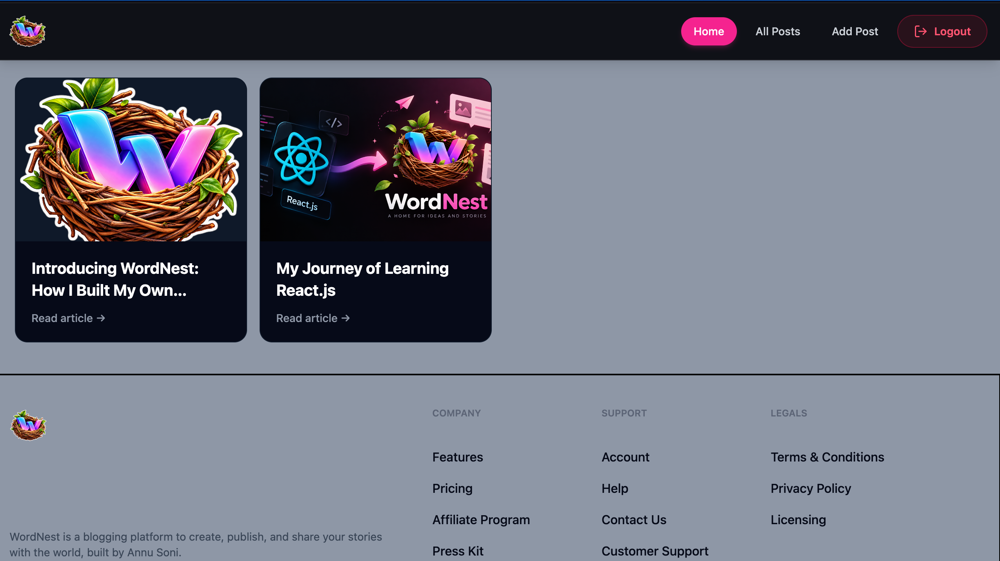
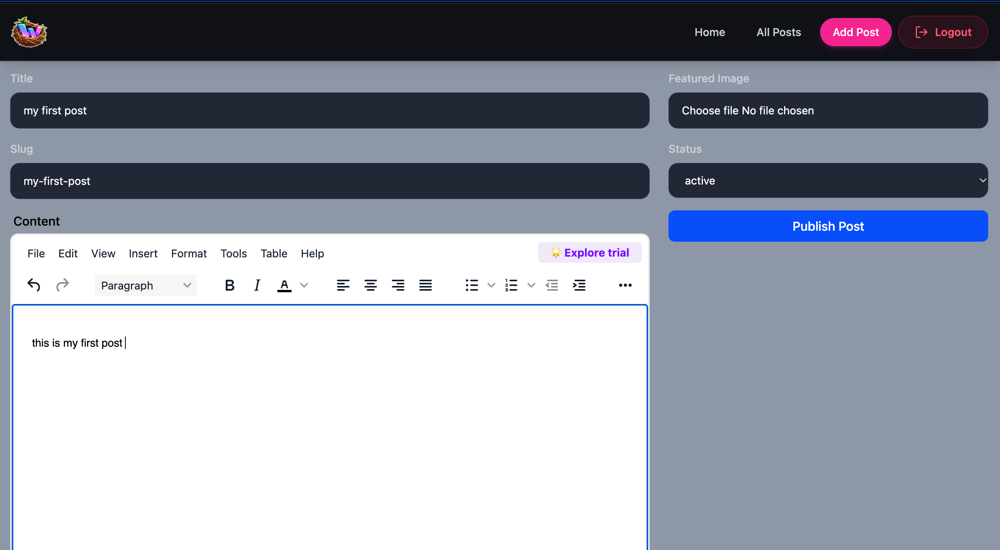
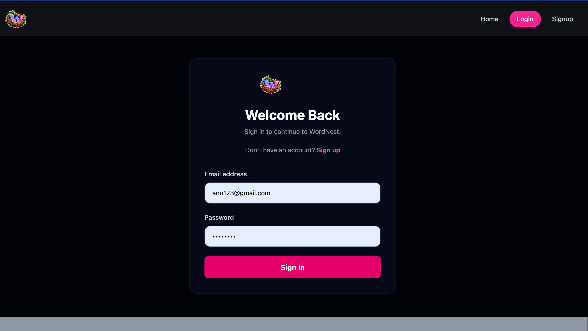

# WordNest — A Home for Ideas and Stories

WordNest is a full-stack blogging platform where users can create, publish, read, and share blog posts. Built with React and Appwrite, it features user authentication, image uploads, rich-text editing, and a responsive interface.

## Live Demo

**Live Website:** https://word-nest-lyart.vercel.app

**GitHub Repository:** https://github.com/Annu9111/Word-Nest

## Features

- User authentication and account management
- Create and publish blog posts
- Rich-text editing with TinyMCE
- Upload featured images for blog posts
- View all published posts
- Individual blog post pages
- Update and delete posts
- Manage post status
- Responsive user interface
- Cloud deployment with Vercel

## Tech Stack

**Frontend**
- React
- Vite
- Tailwind CSS
- React Router
- Redux Toolkit
- React Hook Form
- TinyMCE

**Backend and Services**
- Appwrite Authentication
- Appwrite TablesDB
- Appwrite Storage

**Tools**
- Git and GitHub
- Vercel
- npm

## Screenshots

### Home Page


### Add Post


### Login Page


## Getting Started

### 1. Clone the repository

```bash
git clone https://github.com/Annu9111/Word-Nest.git
```

### 2. Navigate to the project directory

```bash
cd Word-Nest/word-nest
```

### 3. Install dependencies

```bash
npm install
```

### 4. Configure environment variables

Create a `.env` file in the `word-nest` directory and add your own credentials:

```env
VITE_APPWRITE_URL=your_appwrite_endpoint
VITE_APPWRITE_PROJECT_ID=your_appwrite_project_id
VITE_APPWRITE_DATABASE_ID=your_database_id
VITE_APPWRITE_TABLE_ID=your_table_id
VITE_APPWRITE_BUCKET_ID=your_bucket_id
VITE_TINYMCE_API_KEY=your_tinymce_api_key
```

Replace the placeholder values with your own Appwrite and TinyMCE credentials. Configure the corresponding database table, columns, storage bucket, permissions, and approved domains in their respective dashboards.

### 5. Start the development server

```bash
npm run dev
```

Open the local URL displayed in your terminal, usually `http://localhost:5173`.

### 6. Build for production

```bash
npm run build
```

## Project Structure

```text
word-nest/
├── public/
├── Screenshots/
├── src/
│   ├── appwrite/
│   ├── components/
│   ├── pages/
│   ├── store/
│   ├── App.jsx
│   └── main.jsx
├── .env
├── .gitignore
├── package.json
└── README.md
```


## Environment Variables and Security

- Never commit your `.env` file or private credentials.
- Configure environment variables in Vercel for production.
- Variables prefixed with `VITE_` are exposed to the browser. Never store server-side secrets in them.
- Configure Appwrite permissions carefully to prevent unauthorized changes to posts and files.

## What I Learned

- Building a React application with reusable components
- Managing application state with Redux Toolkit
- Implementing navigation with React Router
- Handling forms with React Hook Form
- Integrating Appwrite authentication, database, and file storage
- Adding rich-text editing with TinyMCE
- Deploying a React application using Vercel
- Managing project versions with Git and GitHub


## Author

**Annu Kumari Soni**

- GitHub: https://github.com/Annu9111
- Project: https://github.com/Annu9111/Word-Nest

---

If you find this project useful, consider giving the repository a star!
